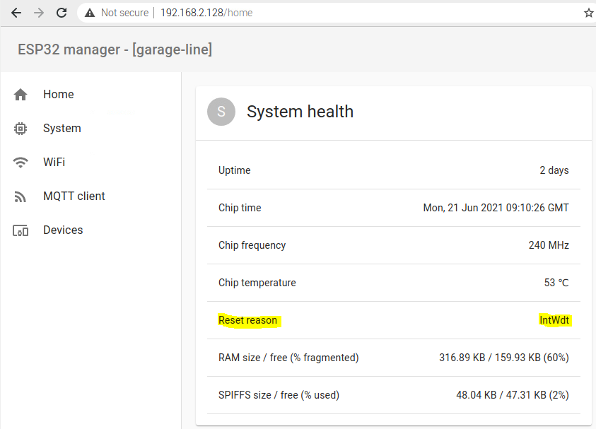
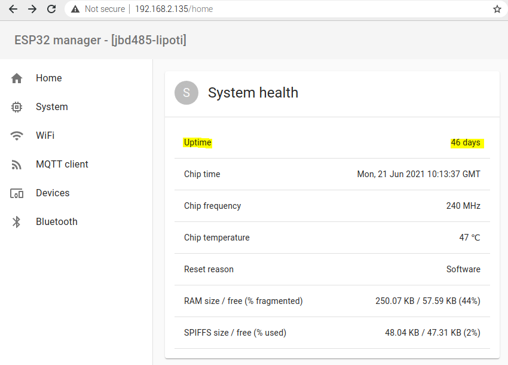

So it all has been working nicely for the past couple of weeks, with one exception. Every few days I see unexpected reboots, and about once a month - permanent freeze in at least one of the boards. Luckily, ESP32 has reset reason register, and I have made it available in the UI:

[The manual](//docs.espressif.com/projects/esp-idf/en/latest/esp32/api-reference/system/wdts.html#interrupt-watchdog) explains:

> The interrupt watchdog makes sure the FreeRTOS task switching interrupt isn’t blocked for a long time. This is bad because no other tasks, including potentially important ones  like the WiFi task and the idle task, can’t get any CPU runtime. A blocked task switching interrupt can happen because a program runs into an infinite loop with interrupts disabled or hangs in an interrupt.

Great! Now I need to know which task is responsible for this. We know ESP-IDF dumps some useful info to UART0 when the watchdog is triggered . How nice would it be to send this info over to my logger that passes it on to the rsyslog daemon over UDP! Regretfully, not in this case. If context switches are blocked, WiFi/networking isn't going to function properly, so it is unlikely we're going to succeed with UDP transmission. Additionally, upon reviewing ESP-IDF's panic handler, there isn't a way to redirect or capture an output without modifying the source. So I thought the easiest would be setting up another Rasberry nearby, connect it to ESP32's UART0 and capture the output continuously, which I did.
Results were puzzling, to say the least. Every time I saw *different* offending task in the log, and sometimes there was *nothing* in the log at all! I started to suspect this may be a hardware issue. I needed a confirmation, so I set up 2 identical ESP32 modules, one on a dev socket, powered by USB, and the other one - "in the field" with all the manual soldering and a buch of wires. Uploaded identical binaries, connected identical peripheral devices. In a week, my first module had 0 issues, still up and running, and the second one froze once and auto-rebooted 3 times. Definitely a hardware problem. Could it be a faulty ESP32 chip? No problem, replaced it and ran the test again - nothing changed. My first setup is still up towards the end of the second week, and the second one reboots and freezes fiercely.

Is now the time to RTFM? Yes! Espressif has lots of PDFs on ESP32, and the solution must be there. The only problem is - too much reading and me being too lazy. Let me rather find a Guru and ask him. [Sinclair Macgregor](mailto:sinclair@sdmideas.com) was very kind to help me. He suggested that the issue is probably related to the power supply:

> I think you are describing a "brown out" a uc type of reset error that can hang a system, I think you have power or vreg issues. From what I see, I believe your main issue for 
stability MAY be related to regulated voltage supply issues in dynamic switching conditions  (you may not see this without use of oscilloscope to capture the events as they may happen quickly enough to leave the IC in an indeterminate state - ie not enough time OFF to actually reset - or not low enough to actually reset but enough to cause what is known as a brown reset where SOME functions of IC reset but not all. Other possible sources of issues look to be the isolation strategy.

It was a revelation. I suddenly remembered that I have another ESP32 powered by a battery, with awful wiring, but an uptime of 46 days! 

Those freezing and rebooting setups were powered by these modules:

as I needed 5v for some of the sensors, and then I used voltage regulator (LD1117 or similar) for 3.3v to power the ESP32. And of course I didn't use any of the capacitors recommended by the datasheet. Real heros don't read datasheets, lol. Now the capacitors are in place, and the problem is solved. Don't be like me, *Read The F****ng Manuals!*

<!--truncate-->

